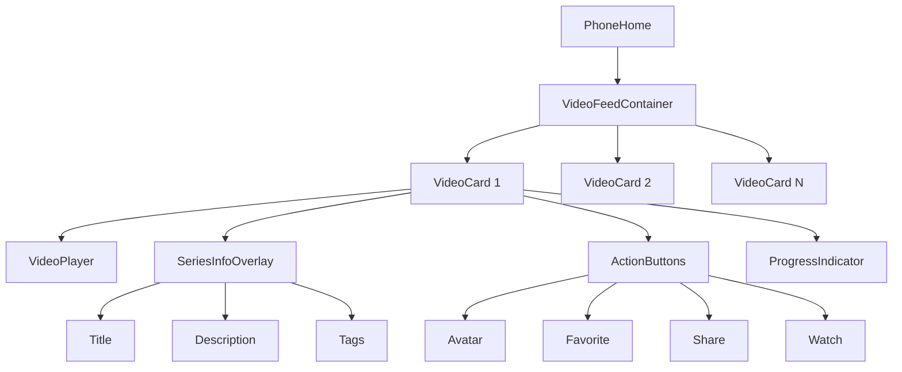
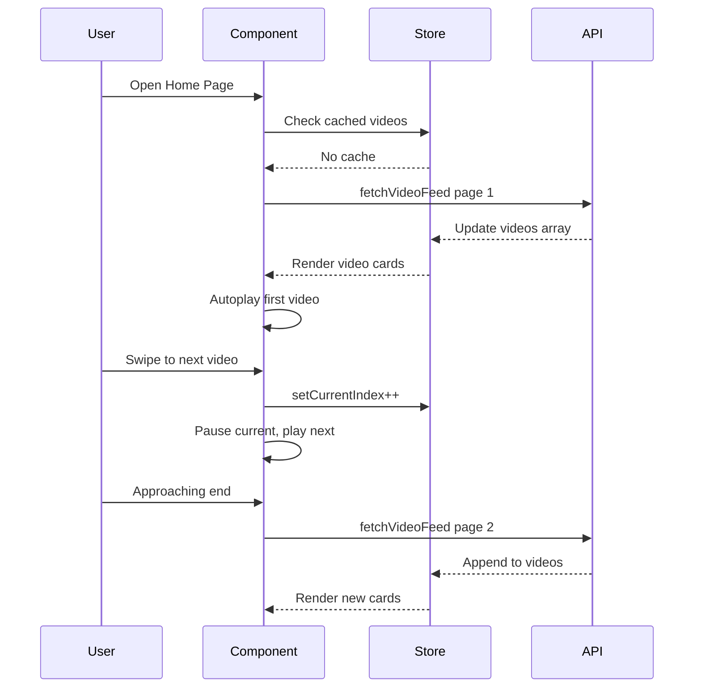

# Phone Home Page Specification

## Overview

The Phone Home page is a TikTok-style vertical swipe video feed, featuring full-screen video playback with series information, action buttons, and smooth vertical scrolling between videos.

## Page Structure

### Layout
- Full-screen immersive video experience
- No header visible during video playback (immersive mode)
- Bottom navigation visible but semi-transparent
- Vertical snap scrolling between videos

### Content Sections (Per Video Card)
1. Full-screen Video Player
2. Series Information Overlay (bottom-left)
3. Action Buttons (right side)
4. Progress Indicator (optional)

## Video Feed Container

### Container
- Full viewport height (100vh / 100dvh)
- Vertical scroll with snap behavior
- scroll-snap-type: y mandatory
- overflow-y: scroll
- Hide scrollbar for clean appearance

### Scroll Behavior
- Each video card snaps to fill the entire viewport
- Smooth momentum scrolling
- scroll-snap-align: start on each video card
- Preload adjacent videos for smooth transitions

## Video Card

### Container
- Full viewport width and height
- Position: relative
- Background: #000 (black)
- scroll-snap-align: start

### Video Player
- Full-screen video element
- object-fit: cover (fills container, may crop)
- Autoplay when in view
- Muted by default (can unmute)
- Loop playback
- Tap to pause/play

### Video Source
- Uses series.videoId for preview video
- Falls back to first episode videoId if no series preview
- Uses Bunny CDN iframe for playback

## Series Information Overlay

### Container
- Position: absolute
- Bottom: 100px (above nav bar)
- Left: 16px
- Right: 80px (leave space for action buttons)
- Z-index: 10
- Pointer-events: auto

### Series Title
- Font size: 18px
- Font weight: 700
- Color: #ffffff
- Text shadow for readability
- Max 2 lines, truncated with ellipsis
- Margin bottom: 8px

### Series Description
- Font size: 14px
- Font weight: 400
- Color: rgba(255, 255, 255, 0.9)
- Text shadow for readability
- Max 2 lines, truncated with ellipsis
- Expandable on tap (show more/less)
- Margin bottom: 12px

### Tags Row
- Horizontal flex layout
- Gap: 8px
- Overflow: hidden (single line)

### Tag Pill
- Background: rgba(255, 255, 255, 0.2)
- Color: #ffffff
- Font size: 12px
- Padding: 4px 10px
- Border radius: 12px
- Backdrop filter: blur(4px)

## Action Buttons (Right Side)

### Container
- Position: absolute
- Right: 12px
- Bottom: 120px
- Flex direction: column
- Gap: 20px
- Align items: center
- Z-index: 10

### Button Style (Common)
- Width: 48px
- Height: 48px
- Border radius: 50%
- Background: rgba(0, 0, 0, 0.3)
- Backdrop filter: blur(4px)
- Display: flex
- Align items: center
- Justify content: center
- Transition: transform 0.2s, background 0.2s

### Button Active State
- Transform: scale(0.9)
- Background: rgba(0, 0, 0, 0.5)

### Button Label
- Font size: 11px
- Color: #ffffff
- Text align: center
- Margin top: 4px

### Favorite Button
- Heart icon (24x24)
- Default: white outline
- Active (favorited): red fill (#ef4444)
- Label: favorite count or "Like"

### Share Button
- Share icon (24x24)
- Color: white
- Label: "Share"
- On tap: Open native share dialog or copy link

### Comment Button (Optional)
- Comment icon (24x24)
- Color: white
- Label: comment count
- On tap: Open comments sheet

### Watch Button
- Play icon (24x24)
- Color: white
- Label: "Watch"
- On tap: Navigate to player page

### Series Avatar
- Position: above action buttons
- Size: 48x48
- Border radius: 50%
- Border: 2px solid white
- Shows series cover image
- On tap: Navigate to series detail

## Progress Indicator

### Container
- Position: absolute
- Bottom: 70px (just above nav)
- Left: 0
- Right: 0
- Height: 3px
- Background: rgba(255, 255, 255, 0.3)

### Progress Bar
- Height: 100%
- Background: #3B82F6 (blue)
- Width: percentage of video played
- Transition: width 0.1s linear

## Video Playback

### Autoplay Logic
- Video plays automatically when scrolled into view
- Previous video pauses when scrolled away
- Use Intersection Observer API
- Threshold: 0.5 (50% visible triggers play)

### Mute/Unmute
- Default: muted (for autoplay compliance)
- Tap volume icon to toggle
- Remember mute preference in localStorage

### Tap to Pause
- Single tap on video area toggles play/pause
- Show play icon overlay briefly when paused

## Data Loading

### Initial Load
- Fetch video feed from API (recommendations or curated list)
- Load first 5-10 videos initially
- Show loading skeleton while fetching

### Infinite Scroll
- Load more videos when approaching end of list
- Trigger load when 2-3 videos from end
- Show loading indicator at bottom
- Append new videos to feed

### API Endpoint
- GET /api/videoFeed
- Parameters: page, limit
- Returns: Array of Series with videoId

## Loading State

### Skeleton
- Full-screen dark background
- Pulsing animation
- Centered loading spinner (optional)

### Error State
- Error message centered
- Retry button
- Pull to refresh support

## Interactions

| Element | Action | Result |
|---------|--------|--------|
| Video | Tap | Toggle play/pause |
| Video | Swipe up | Go to next video |
| Video | Swipe down | Go to previous video |
| Series Title | Tap | Navigate to series player |
| Tag | Tap | Navigate to genre with tag |
| Favorite Button | Tap | Toggle favorite (login required) |
| Share Button | Tap | Open share dialog |
| Watch Button | Tap | Navigate to series player |
| Series Avatar | Tap | Navigate to series player |
| Volume Icon | Tap | Toggle mute/unmute |

## Gestures

### Vertical Swipe
- Native scroll with snap
- Momentum scrolling
- Snap to nearest video

### Double Tap
- Double tap to favorite (like TikTok)
- Show heart animation on double tap

## Performance Optimizations

### Video Preloading
- Preload next video while current plays
- Unload videos more than 2 positions away
- Use video preload="metadata" for distant videos

### Memory Management
- Limit DOM nodes (virtualization if needed)
- Dispose video elements when far from viewport
- Use requestAnimationFrame for animations

### Network Optimization
- Adaptive quality based on connection
- Progressive loading
- Cache video metadata

## Accessibility

### Screen Reader
- Announce video title when focused
- Describe action buttons
- Provide skip navigation

### Reduced Motion
- Respect prefers-reduced-motion
- Disable autoplay if reduced motion preferred
- Use instant transitions instead of animations

## Internationalization

### Labels
- English: "Like", "Share", "Watch", "Comments"
- Chinese: "喜欢", "分享", "观看", "评论"

## Component Structure

```
PhoneHome
├── VideoFeedContainer
│   ├── VideoCard (multiple)
│   │   ├── VideoPlayer
│   │   ├── SeriesInfoOverlay
│   │   │   ├── SeriesTitle
│   │   │   ├── SeriesDescription
│   │   │   └── TagsRow
│   │   ├── ActionButtons
│   │   │   ├── SeriesAvatar
│   │   │   ├── FavoriteButton
│   │   │   ├── ShareButton
│   │   │   └── WatchButton
│   │   └── ProgressIndicator
│   └── LoadingIndicator
└── PhoneNavBar (from layout)
```

## State Management

### Video Feed Store
- videos: Series[]
- currentIndex: number
- loading: boolean
- hasMore: boolean
- page: number

### Actions
- fetchVideoFeed(page)
- setCurrentIndex(index)
- toggleFavorite(seriesId)
- loadMore()

## CSS Variables

```css
--video-feed-bg: #000000;
--overlay-gradient: linear-gradient(transparent, rgba(0,0,0,0.8));
--action-btn-bg: rgba(0, 0, 0, 0.3);
--action-btn-size: 48px;
--info-padding: 16px;
--nav-height: 70px;
```

## Mermaid Diagram - Component Flow



## Mermaid Diagram - Data Flow


